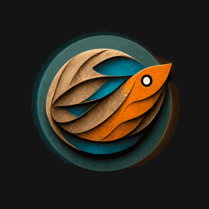

<p align="center">
  
</p>

<h1 align="center">Phishtopia.com</h1>

<p align="center">
  A growing full-stack web development hub built with Node.js, Express, EJS, PostgreSQL, and questionable amounts of caffeine.
</p>

<p align="center">
  <a href="https://phishtopia.com">Live Site</a>
</p>

---

## Overview

Phishtopia.com is my personal web development project hub and growing full-stack web application. It began as a place to showcase course projects and experiments, but it has grown into a larger Node.js/Express platform with authentication, PostgreSQL-backed features, third-party API integrations, original tools, and production-style deployment.

The project is actively evolving as I continue learning full-stack development, improving the architecture, and turning individual experiments into more polished applications.

---

## Production Status

Phishtopia is currently running on a small **Google Cloud Compute Engine VM** instead of a managed Cloud Run + Cloud SQL setup. The goal is to keep the project consolidated in GCP while staying realistic for a low-traffic personal project.

Current production setup:

- Production URL: `https://phishtopia.com`
- VM name: `phishtopia-vm`
- Region / zone: `us-east1` / `us-east1-b`
- Static IP: `34.73.92.179`
- Web server: Nginx
- App runtime: Node.js 22
- Process manager: PM2
- Database: local PostgreSQL on the VM
- HTTPS: Let's Encrypt certificates managed by Certbot
- Primary domain: `phishtopia.com`
- `www.phishtopia.com` redirects to `https://phishtopia.com`

Production request flow:

```text
Namecheap DNS
  -> GCP static IP
  -> Nginx
  -> Node / Express app on localhost:3002
  -> Local PostgreSQL on localhost:5432
```

The previous Cloud Run deployment and old external database should be kept temporarily as rollback options until the VM setup has been stable for a while.

---

## Production Management

Most production commands are run on the VM.

SSH into the VM:

```bash
gcloud compute ssh phishtopia-vm --zone=us-east1-b
```

The app currently lives at:

```text
/home/codespace/phishtopia
```

Sensitive runtime files are stored outside the Git repository:

```text
/home/codespace/phishtopia/.env
/home/codespace/phishtopia-secrets/db.env
/home/codespace/phishtopia-secrets/app.env
```

Do not commit secrets, `.env` files, SQL dumps, or backup files.

Check the running app:

```bash
sudo -u codespace env PM2_HOME=/home/codespace/.pm2 pm2 status
curl -I https://phishtopia.com/health
curl -I https://www.phishtopia.com/health
sudo systemctl status pm2-codespace --no-pager
sudo systemctl status certbot.timer --no-pager
```

View recent app logs:

```bash
sudo -u codespace env PM2_HOME=/home/codespace/.pm2 pm2 logs phishtopia --lines 50
```

Deploy the latest code from `main` to the VM:

```bash
cd /home/codespace/phishtopia
git pull origin main
npm ci --omit=dev
pm2 restart phishtopia --update-env
pm2 save
```

GitHub remains the source of truth for the codebase, but production is currently updated manually on the VM. A simple deploy script is planned.

---

## Current Features

### Project Hub

A collection of web development projects, experiments, and course-inspired builds organized through a central projects page.

### YouList

YouList is a movie and TV list application using the TMDB API. Users can search for titles, view details, and add personal comments to movies and shows.

Current features include:

- TMDB search integration
- Movie and TV detail views
- User authentication
- User comments
- PostgreSQL-backed storage
- Pagination
- API response caching
- Optional TMDB cache prewarming controlled by environment variable

### EchoTrace

EchoTrace is an Eve Echoes player intelligence tool that analyzes public killmail data to identify player activity patterns.

Current features include:

- Player search by name or ID
- Killer and victim filtering
- Date range filtering
- Top regions, constellations, and systems
- Activity-by-hour visualization
- Legacy `/player-int` route support

---

## Tech Stack

### Application

- Node.js 22
- Express 5
- EJS
- PostgreSQL
- bcrypt
- express-session
- connect-pg-simple
- express-rate-limit
- Nodemailer
- Axios
- node-fetch
- TMDB API
- Echoes.mobi killmail API

### Production Infrastructure

- Google Cloud Compute Engine
- Debian 12
- Nginx reverse proxy
- PM2 process manager
- Local PostgreSQL
- Certbot / Let's Encrypt HTTPS
- Namecheap DNS

### Development / Utility Tooling

- Docker
- GitHub Codespaces
- Google Cloud SDK
- GitHub

---

## Project Goals

Phishtopia is both a portfolio and a learning platform. My goals are to keep improving it as a real production-style application while practicing:

- Full-stack application architecture
- Authentication and session handling
- API integration
- PostgreSQL schema design
- Deployment and cloud migration
- Linux server administration
- Nginx reverse proxy configuration
- Process management with PM2
- DNS and HTTPS configuration
- User-focused interface design
- Performance, caching, and logging
- Clean project organization

---

## Planned Improvements

- Add automatic local PostgreSQL backups
- Add a simple production deploy/update script
- Keep the VM stable for a while before retiring the old Cloud Run deployment and old external database
- Move production runtime ownership from the temporary `codespace` user to a dedicated app user later
- Add better analytics and usage tracking
- Improve authentication flows, including email verification, password reset, and account management
- Improve project organization by separating routes, services, and database logic
- Move remaining mature projects out of the old App Brewery structure
- Continue improving EchoTrace and YouList with more polished features

---

## Local Development

Clone the repository:

```bash
git clone https://github.com/PhishyOne/Phishtopia.com.git
cd Phishtopia.com
```

Install dependencies:

```bash
npm install
```

Create a `.env` file in the project root. Use `.env.example` as the starting point:

```bash
cp .env.example .env
```

Important environment variables include:

```bash
PORT=3002
NODE_ENV=development
SESSION_SECRET=

DATABASE_URL=
# or DB_USER / DB_PASSWORD / DB_HOST / DB_NAME / DB_PORT

TMDB_API_KEY=
EMAIL_USER=
EMAIL_PASS=

PREWARM_TMDB_CACHE=false
LOG_SESSIONS=false
LOG_UNIQUE_STATIC_IPS=false
LOG_DB_CONFIG=false
```

Start the server:

```bash
npm start
```

The app runs locally on:

```text
http://localhost:3002
```

Health check:

```text
http://localhost:3002/health
```

---

## Docker

Docker is available for local testing and one-off utility work. The production VM currently runs the app directly with Node.js and PM2 rather than running the app container.

Build locally:

```bash
docker build -t phishtopia .
```

Run locally with an env file:

```bash
docker run --rm \
  --env-file .env \
  -p 8080:8080 \
  phishtopia
```

Then visit:

```text
http://localhost:8080/health
```

---

## Database Notes

The application supports either a full `DATABASE_URL` connection string or split database variables such as `DB_USER`, `DB_HOST`, and `DB_NAME`.

Production currently uses local PostgreSQL on the VM. The application connects through `DATABASE_URL` stored in the VM's local `.env` file. Sessions are stored in PostgreSQL through `connect-pg-simple`, using the shared configured database pool.

Current production database basics:

```text
DB_HOST=127.0.0.1
DB_PORT=5432
DB_NAME=phishtopia
DB_USER=phishtopia
DB_SSL=false
```

To inspect the production database from the VM:

```bash
sudo -u codespace bash -lc '
set -a
source /home/codespace/phishtopia-secrets/db.env
set +a

PGPASSWORD="$DB_PASSWORD" psql -h 127.0.0.1 -U "$DB_USER" -d "$DB_NAME"
'
```

To create a manual backup from the VM:

```bash
sudo -u codespace bash -lc '
set -a
source /home/codespace/phishtopia-secrets/db.env
set +a

mkdir -p /home/codespace/backups
pg_dump "$DATABASE_URL" \
  --format=custom \
  --no-owner \
  --no-acl \
  --file="/home/codespace/backups/phishtopia-prod-$(date +%Y%m%d%H%M%S).dump"
'
```

Do not commit database dumps or backup files to GitHub.

---

## Notes

This project is actively under development. Some features are experimental, and parts of the codebase still reflect its origin as a learning/coursework project.

The long-term goal is to continue refactoring Phishtopia into a cleaner, scalable, production-style web application while keeping it useful, creative, and fun to build.

---

## Author

Built by PhishyOne as part of an ongoing web development learning journey.
